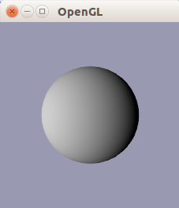

# Sphere Generation

Here are two Python scripts, that show a sphere using a simple Lambertian shader.

The first script, `sphere_glut.py` uses GLUT for OpenGL context management, whereas the second script `sphere_sdl.py`
uses SDL2 for this reason.



## Keyboard 

  - Arrow Keys: Move around
  - Y: change the lighting direction
  - S: make a screenshot, and save file to `test.png`
  - D: reserved key for debug information in future

## Prerequisites

Please make sure that you have [Python2](www.python.org) and [PyOpenGL](http://pyopengl.sourceforge.net/) and
[Numpy](http://www.numpy.org/) and [Pillow](http://python-pillow.github.io/)(a PIL fork) installed.

On Ubuntu:

```bash
$ apt-get install python python-numpy python-pip python-pil
$ pip install PyOpenGL PyOpenGL_accelerate
```
Note, maybe you need to execute these commands as root.


### Using GLUT version
According to the [PyOpenGL](http://pyopengl.sourceforge.net/) page, the PyOpenGL package already provides GLUT, so you should be fine.

### Using SDL2 version

For the SDL script you need to install SDL2. Using pip, you can do so quite easily:

```bash
$ pip install pysdl2
```

